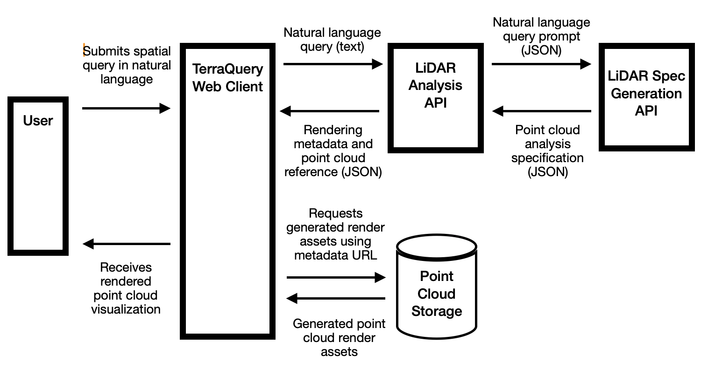

# TerraQuery

Point cloud analysis powered by natural language.

Project includes everything needed to train a small language model locally, as well as all files needed to run the web application locally.

The only thing that is not included are the demo tiles; send me a message if you would like access to these.

## Training the Model

Download the required dependencies
```
pip install \
  torch \
  transformers \
  scikit-learn \
  numpy \
  sentencepiece \
  accelerate
```
Augment the seed data
```
python3 data_augment.py
```
Train the model
```
python3 train_flan_t5_small.py
```

## Running the TerraQuery Application
Change into the project directory
```
cd terraquery
```
Download the prerequisite components
- Demo tiles (.LAS); I will send these on request. Place them in the directory named 'demo-tiles'
- The trained model should live within the following directory: 'spec-geneator-model/terraquery-flan-t5-small'. Train using the steps above or message me for a base implemenation.

Build the application
```
docker compose build --no-cache
```
Run the application
```
docker compose up
```

## Architecture Overview

